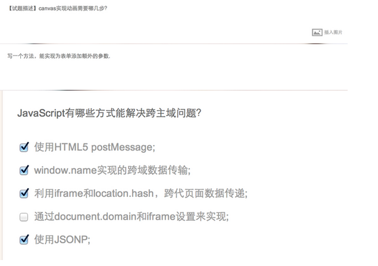
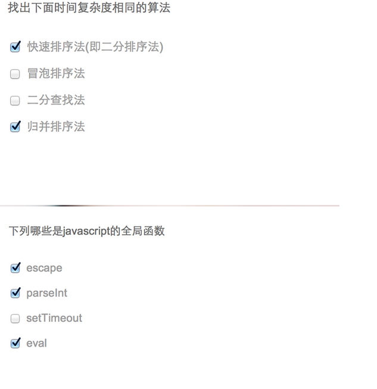

[国内大型互联网公司（如BAT）对于web前端开发方向校招都考些什么？](http://www.zhihu.com/question/26188893) 

1. 如何在页面上实现一个圆形的可点击区域。能想到用map+area或者svg的，我觉得html可能比较熟；能想到border-radius的，我觉得css可能比较熟。如果实在想不出来什么，我就引导他回答纯js实现，这个时候就问问怎么求一个点在圆上这种简单算法，加上js的Math几个api，怎么获取鼠标坐标什么的。

2. 用js实现千位分隔符（千位分隔符_百度百科），这道题挺考逻辑的，看起来简单，写起来不太容易，如果回答三位循环、字符串数组分隔之类的，可以深度问下去，在加上正负号什么的看看对方的应变能力。如果能用一条正则+replace搞定，那就加分啦。

3. 有一个高度自适应的div，里面有两个div，一个高度100px，希望另一个填满剩下的高度。这题有js解法、一般css解法、css3解法等。

        什么是闭包？
        JS如何实现类，继承？
        什么是冒泡和捕获？
        JS有哪些数据类型？
        Null和Undefined的区别？
        判断时if是false的值？
        isNaN（）的作用？
        JS对象中的Array对象和String对象的各种方法
        this关键字在不同环境下的指向
        JS的作用域
        setTimeout和setInterval
        了解CSS3或HTML5吗，都用过哪些
    
技能延伸：

　　前面两者技术的基础上对技能的延伸能增加获得offer的机会，比如了解模板引擎、熟悉比较火的前端框架或前端技术（JQuery、Bootstrap、Zepto、Node，Angular.JS），并且研究过源码、对svn或git等版本控制软件的操作、 长期更新博客、 在github上有所贡献等，这些都是绝对的加分点，这些并不是说都要做，如果能选中其中一两项有所成果应该是能加分的。
　　
1、盒装模型，以及在不同标准下的表现。（问到什么程度？比如最近会问何时margin会重叠）

2、基本CSS的知识自行了解清楚（优先级、选择器、伪类、浮动元素、HACK等）

3、原型与实现继承（特别重要！！我手下面80%应届生不熟悉原型，也许学校没实际应用过，但是不知道原型基本可以枪毙了）

4、作用域、声明提前（特别喜欢拿这个做文章，分开出三道，第一道不会教你，剩下两道埋坑考察当场学习能力）

5、基本插件如JQ等的使用和部分代码分析或实现

6、原生JS的使用（创建、插入DOM，不同浏览器事件）

7、跨域实现

8、如何改善页面性能

9、事件代理

10、this、call、apply、callee 孰知应用

11、正则

12、布局，浮动布局，自适应布局，自适应左右分栏的实现（纯CSS）

基本上原型作用域配合的题目够把你面出个三六九等，搞清楚基础知识再来面试，对面试官是种尊重吧。（原谅我用尊重这个词，因为每次抽1小时问面试，对方连原型都没听过，还要倒过来教，心很累哒）

进阶版：

1、AMD CMD 模块化JS

2、同步、异步、回调、promise实现

3、各种算法、数组去重等

4、前端开发框架、编译、打包（选择一家方案使用了解）

5、CSS3、HTML5常用方法

6、重绘与回流及相关性能

7、webkit内核特有的一些API

8、MVC/JS面向对象思想

